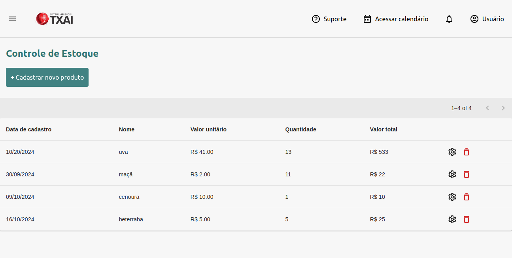

## Pré-requisitos

- [Docker](https://www.docker.com/get-started)
- [Docker Compose](https://docs.docker.com/compose/install/)

## Instalando e rodando o projeto:

```bash
   git clone https://github.com/emkreimer/ma-shop.git
   cd ma-shop
   cp .env.example .env
   docker-compose up -d --build
```

- Com a aplicação rodando, você pode acessá-la pelos endereços `localhost:3001` e `localhost:3000`.

- Para parar o serviço, use `docker compose down`.

- Para debugar, use `docker compose logs <serviço>`.

## Sobre o projeto:

É uma aplicação fullstack para gerenciamento de produtos. Para acessar, você deve criar sua conta com permissão de usuário comum ou de administrador.
O usuário comum vê todos os produtos disponíveis, mas só pode editar e deletar os que pertencem a ele. O administrador não tem restrições.

## Tecnologias usadas:

- Nest;
- React;
- TypeORM;
- Tailwind CSS;
- JWT

## Páginas

Login:


Criar usuário:


Página inicial:



Modais:


